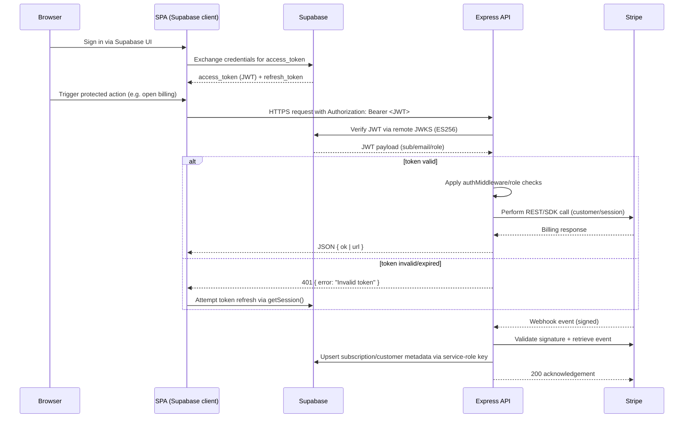

# Graphs

## Dependency Graph
```mermaid
graph TD
  Root[root package.json] --> App[app workspace (Vite SPA)]
  Root --> Marketing[marketing workspace (Vite static site)]
  Root --> Server[server workspace (Express API)]
  Root --> Shared[@kkarlsen/shared]
  App --> Shared
  Marketing --> Shared
  App -->|Supabase JS client| Supabase[(Supabase)]
  App -->|Fetch| Server
  Marketing -->|Fetch| Server
  Server -->|Service role client| Supabase
  Server -->|Storage uploads| SupabaseStorage[(Supabase Storage buckets)]
  Server -->|REST+Webhooks| Stripe[(Stripe API)]
  Stripe -->|Webhook events| Server
```

## HTTP Route Groups
```mermaid
graph TD
  subgraph Public
    H1[GET /health]
    H2[GET /health/deep]
    H3[GET /]
    H4[GET /metrics]
    H5[GET /config]
    H6[GET /ping]
  end
  subgraph Billing (JWT required)
    B1[POST /api/billing/start]
    B2[POST /api/checkout]
    B3[POST /checkout]
    B4[POST /api/portal]
    B5[POST /portal]
    B6[POST /api/stripe/create-portal-session]
    B7[POST /stripe/create-portal-session]
    B8[POST /api/portal/upgrade]
    B9[POST /portal/upgrade]
    BW[POST /api/stripe-webhook (raw)]
  end
  subgraph Account (authMiddleware)
    S1[GET /settings]
    S2[PUT /settings]
  end
  subgraph Admin (authenticateUser + requireAdmin)
    A1[POST /admin/link-customer]
    A2[GET /admin/unlinked-customers]
    A3[GET /audit-log/recent]
  end
  Public --> Billing
  Public --> Account
  Billing --> Admin
```

## Auth & Session Flow

