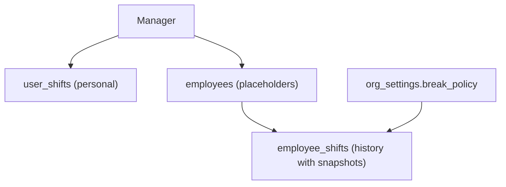

## Architecture (2-minute read)

- "Manager personal shifts" table: `user_shifts`
  - Owned by the manager (authenticated user)
  - Can optionally reference `employees.id` via `employee_id`
  - Used for the manager’s own planner UI and exports

- "Placeholder employees" table: `employees`
  - Manager-owned rows, not real auth users
  - Fields: `name`, `email?`, `hourly_wage?`, `tariff_level? (-2,-1,1..6, 0=custom)`

- "Authoritative history" table: `employee_shifts`
  - Every row captures immutable wage context at creation/edit time:
    - `employee_name_snapshot`
    - `tariff_level_snapshot`
    - `hourly_wage_snapshot`
  - Org break policy applied on read to compute `paid_hours` and `gross`

Flow overview:
1) Manager creates an employee (custom wage or tariff)
2) Creating an employee shift computes snapshots from the employee row
3) Changing an employee later does NOT mutate old shift snapshots; new shifts take new snapshots

### Diagram

## Snapshots: what and why

- Taken on create/update of `employee_shifts` from current `employees` row
- Fields: `employee_name_snapshot`, `tariff_level_snapshot`, `hourly_wage_snapshot`
- Purpose: history doesn’t change when employee wage/tariff changes later

## Org settings: break_policy

- Options: `fixed_0_5_over_5_5h`, `none`, `proportional_across_periods`, `from_base_rate`
- Endpoint: `GET/PUT /org-settings`
- Effect: controls automatic deduction applied when reading shifts:
  - `fixed_0_5_over_5_5h`: deduct 0.5h when duration > 5.5h
  - `none`: no automatic deduction
  - The others are compatible variants; default safe fallback is proportional

## Tariff levels

- Supported levels: `-2, -1, 1..6`; `0 = custom wage`
- Mapping implemented in server code (example values):
  - -1: 129.91, -2: 132.90, 1: 184.54, 2: 185.38, 3: 187.46, 4: 193.05, 5: 210.81, 6: 256.14

## Agent permissions

- JWT claim `ai_agent=true` → read-only for `/employees` and `/employee-shifts`
- Writes (POST/PUT/DELETE) return `403`, record an audit event, and increment a metric counter
- Metrics: `/metrics` exposes `agent_write_denied_total{route,method,reason}`
- Recent audit: `GET /audit-log/recent?limit=100`

## Exports (CSV)

- UI CSV includes columns in this order:
  - `Dato, Dag, Start, Slutt, Timer, Grunnlønn, Tillegg, Totalt, Type, Serie`

## Rollbacks

- Emergency: disable employees feature or revert break policy via `/org-settings`
- Legacy column re-enable: server tolerates missing columns (graceful fallbacks via helpers
  like `isColumnMissing`), and UI retains legacy settings fields (e.g., `pauseDeduction`) to
  preserve backward compatibility if you need to temporarily roll back DB changes.

